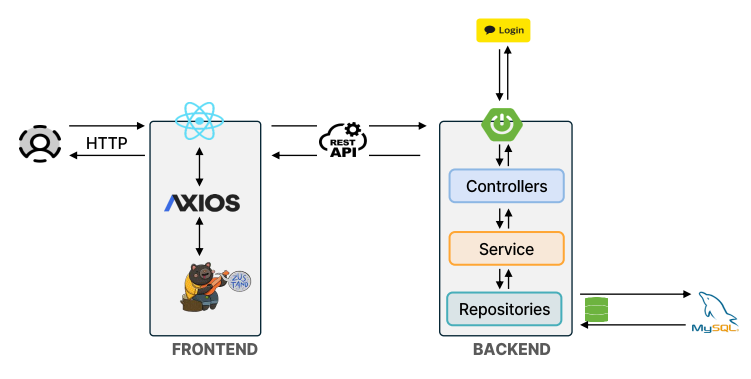

# FlipIt!
---
## 개발 내용
- JWT 토큰 기반의 로그인 회원가입 유저 권한 에 따른 서비스 접근 제어
- 기록 유무에 따른 게임 이어하기 및 데이터 기반 카드 자동 배치
- 단계 클릭수 등록순 기반의 랭킹 시스템
- 관리자 전용 카드 추가와 삭제 및 유저 관리 페이지
- 카카오 간편 로그인 추가

---

## 기술 스택

- Back-end: Spring Boot, Spring Security, JWT, Spring Data JPA, Rest API
- Front-end: React, JaveScript, Zustand, Axios
- Database: MySQL
- Tools: Git, GitHub

---

## 시스템 아키텍처

  

---

## 기획 의도

누구나 가볍게 즐길 수 있는 게임을 목표로 직관적인 인터페이스로 사용자에게 즐거움을 주고자 ,
기획된 서비스입니다.

---

## 유튜브 링크
https://www.youtube.com/watch?v=4xL2Qi9LZPc

