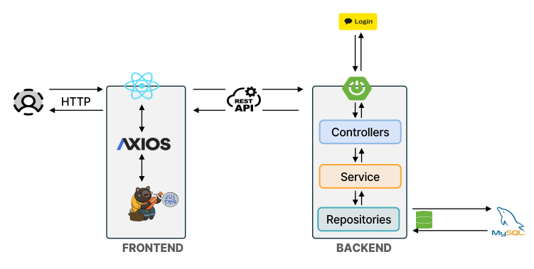

# FlipIt!

누구나 가볍게 즐길 수 있는 게임을 목표로, 직관적인 인터페이스를 통해 사용자에게 즐거움을 제공하고자 기획된 웹 기반 미니 게임 서비스입니다.

 

## 🛠 주요 개발 내용

- JWT 토큰 기반의 로그인/회원가입 및 유저 권한에 따른 서비스 접근 제어
- 카카오 간편 로그인 기능 연동
- 기록 유무에 따른 게임 이어하기 및 데이터 기반 카드 자동 배치 로직 구현
- 단계별, 클릭수, 등록순 기반의 랭킹 시스템 구축
- 관리자 전용 카드 추가/삭제 및 유저 관리 페이지 구현

 

## 💻 기술 스택

- **Back-end:** Spring Boot, Spring Security, JWT, Spring Data JPA, REST API
- **Front-end:** React, JavaScript, Zustand, Axios
- **Database:** MySQL
- **Tools & Collaboration:** Git, GitHub

 

## 🏗 시스템 아키텍처

  

 

## 🎥 시연 영상

[FlipIt! 프로젝트 시연 영상 보러가기](https://www.youtube.com/watch?v=4xL2Qi9LZPc)
